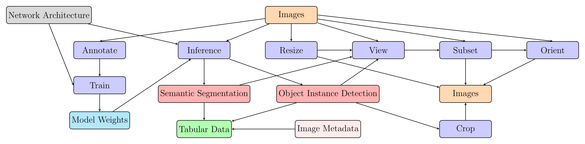

# Gwel
The *gwel* Python module provides a framework for handling large image datasets and using neural networks for computer vision tasks in crop science research. The module supports object instance detection and semantic segmentation. The flowchart below outlines the workflows that can be achieved using this module. 



Maintained and created by Jack Rich (j.b.c.rich@pgr.reading.ac.uk), Department of Crop Science, School of Agriculture, Policy, and Development; University of Reading as part of my PhD research. 


## Installation

### 1 Clone this repo
```bash
git clone -
cd gwel
```


### 2 Create Virtual Environment
With [conda](https://docs.anaconda.com/miniconda/install/) (recommended):

```bash
conda env create -f environment.yml
conda activate gwel
```

With venv (Linux and macOS):
```bash
python3.10 -m venv gwel
source gwel/bin/activate
pip install -r requirements.txt
```

With venv (Windows):
```powershell
python3.10 -m venv gwel
gwel\Scripts\activate 
pip install -r requirements.txt
```


### 3 Install gwel
```bash
pip install -e .
```
## Basic Usage

Initiate an image dataset:
```python
from gwel import ImageDataset
dataset = ImageDataset('path/to/directory/of/images')
```
Check status of a dataset:
```python
dataset.status()
```

Resize images (creates resized copies of images in .gwel hidden directory):
```python
dataset.resize_images()
```

View images:
```python
dataset.view_images()
```
For detailed tutorials, visit [the wiki](https://gitlab.act.reading.ac.uk/bw832080/dph-reading/-/wikis/home).

## Acknowledgments
This research is funded by the [Biotechnology and Biological Sciences Research Council (BBSRC)](https://www.ukri.org/councils/bbsrc/), part of [UK Research and Innovation (UKRI)](https://www.ukri.org/), through the [FoodBioSystems Doctoral Training Partnership (DTP)](https://research.reading.ac.uk/foodbiosystems/) as part of my PhD project at the [University of Reading](https://www.reading.ac.uk/).


